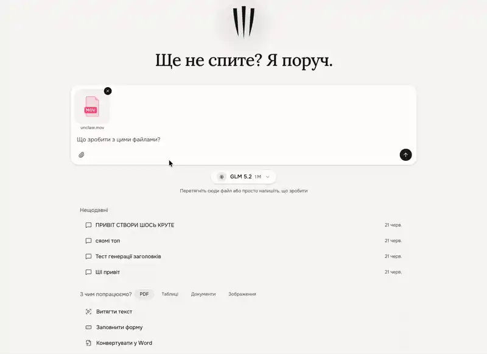

# Capka 🐾

[](LICENSE)
[](#prebuilt-images)

Hi — I'm building **Capka** because I couldn't find a decent open-source web UI
that treats AI as a real *agent*, not just a chatbot.

Think of it as an **open-source, self-hosted take on Claude's Cowork** — an agent
with its own computer, not a chat box. Most AI UIs are thin wrappers around an
API. Capka gives every user and every chat its own **isolated Linux sandbox**:
the agent accepts files, writes and runs code, scrapes the web, converts
documents, and uses MCP connectors — safely, in its own container, behind your
own API keys.


> 💡 **What's in the name?** *Capka* (say *[tsap-ka]* — or just "cap-ka", I won't
> mind) comes from the Ukrainian *цап-царап*, the quick swipe of a cat's claws —
> yep, that's the logo. I liked the picture: an agent that grabs your files and
> digs right into them.

## Why I built this

The internet is flooded with weekend-project chat apps that look generic, choke
on real tasks, or leak raw JSON errors at users. I wanted a runtime I could host
on a cheap VPS for myself, my friends, and my team.

Drop in a file and just ask — Capka runs real tools (`ffprobe`, `ffmpeg`, …)
inside its sandbox and reports back:



What you get:

- **Real isolation** — code execution and document work run inside a per-session
  Docker container (Python 3.12, Node 22, Java, FFmpeg, ImageMagick, LibreOffice,
  LaTeX, Playwright, OCR, …). The agent never touches the host.
- **It doesn't forget** — every turn is an independent task on a Postgres-backed
  queue, run by an in-process worker. Close your laptop or restart the server and
  the agent keeps going — the reply isn't lost.
- **No "AI slop" UX** — I polished the UI by hand to feel like a real, considered
  tool. Provider timeouts and rate limits are caught and turned into calm,
  localized messages — the end user never sees a raw `402`.
- **Extensible** — Anthropic-compatible skills, MCP connectors (incl. OAuth), and
  a small marketplace, with per-capability allow/ask/deny governance and an audit
  log.

## How it works under the hood

A flat, efficient architecture so it's easy to self-host — even on one box.

| Service | What it is |
|---|---|
| **platform** | The Next.js app + the in-process task worker (UI, APIs, agent loop). |
| **postgres** | The brain: system of record **and** the realtime task queue (`LISTEN/NOTIFY`). |
| **sandbox-controller** | A tiny HTTP service that spawns/kills per-session containers. It reaches Docker only through the socket-proxy, never the raw socket — guarded by `CONTROLLER_SECRET`. |
| **socket-proxy** | A firewall for the Docker API: only container + exec endpoints. The host socket is mounted read-only here alone, on an isolated network. |
| **sandbox** | The execution image (`Dockerfile.sandbox`) — built once, reused per session. |

> ⚠️ **Heads up if you want to contribute:** this runs on a heavily customized
> **Next.js 16**. Because of the in-process worker loop, it's *not* a stock
> Next.js app — read `AGENTS.md` and check `node_modules/next/dist/docs/` before
> touching framework internals.

## Getting started (local dev)

Zero-config — the dev compose file uses loopback-only ports and dev secrets, so
there's no `.env` to write:

```bash
npm run docker:dev
```

Open http://localhost:3000 and create your admin account.

## Deployment (production)

On a fresh Linux box, one command installs Docker (if missing), fetches Capka,
and brings the full stack up with automatic HTTPS (via Caddy) — point your DNS
at the host first:

```bash
curl -fsSL https://raw.githubusercontent.com/LyoSU/capka/master/install.sh | DOMAIN=capka.example.com sh
```

Omit `DOMAIN` (or just run it with no env) and it boots on `:3000` (HTTP) so you
can front it with your own reverse proxy; run it without piping and it'll prompt
for the domain interactively. Prefer to read before you run? Good instinct:

```bash
curl -fsSL https://raw.githubusercontent.com/LyoSU/capka/master/install.sh -o install.sh
less install.sh && sh install.sh
```

Already have Docker and a clone? The installer just wraps this:

```bash
git clone https://github.com/LyoSU/capka && cd capka
DOMAIN=capka.example.com ./scripts/up.sh     # or: npm run up
```

`up.sh` generates strong secrets into `.env` on first run (it never overwrites
values you've set), pulls the prebuilt images, then starts the stack. Re-running
the installer upgrades in place (`git pull` + image refresh).

> Capka runs as a **long-lived process** — serverless/edge hosts that freeze
> between requests won't work.

### Which path is for me?

| Your setup | Do this |
|---|---|
| Just testing (no sandbox) | One-click PaaS: **Railway** (`deploy/railway.json`) or **Fly.io** (`deploy/fly.md`) — *platform only, no Docker daemon → no code sandbox there*. |
| Solo / small team on a VPS | `DOMAIN=… npm run up` (turnkey HTTPS above), or one-click **Coolify** (`deploy/coolify.md`) — deploys onto a host with a Docker daemon, so you get the **full stack incl. the sandbox**. |
| Higher-trust / company | External managed Postgres, rootless Docker, SSO — see `SECURITY.md`. |

### Secrets

`npm run up` generates these for you, or set them yourself (see `.env.example`):

- `POSTGRES_PASSWORD` — Postgres password; `DATABASE_URL` is derived from it.
- `CONTROLLER_SECRET` — shared platform↔controller secret. The controller
  **refuses to boot** on the default value — `openssl rand -hex 32`.
- `CAPKA_MASTER_KEY` — 64-hex key that encrypts provider API keys at rest, kept
  *outside* the DB so a DB leak alone can't decrypt them.
- `PUBLIC_URL` *(optional)* — your public origin; unset → derived from proxy
  headers. Set it behind a proxy (it's the non-spoofable source for auth
  callbacks and absolute links).

### Prebuilt images

Release tags publish `platform`, `controller`, and `sandbox` images to GHCR
(`ghcr.io/lyosu/capka-*`), so a host with no build toolchain doesn't compile
anything — `up.sh` pulls them by default. The `build:` stanzas stay as a
fallback: if a pull fails (offline, or you're on an unpublished commit), the
affected images build locally. To always compile from source instead:

```bash
CAPKA_BUILD=1 ./scripts/up.sh
```

## Security & sandboxing

Out of the box, sandboxes run on the standard `runc` runtime (works on any Docker
host). Containers are unprivileged (the entrypoint drops to `1000:1000`), drop
all capabilities, and have **no outbound network** by default — set
`SANDBOX_ALLOW_NETWORK=true` if your agents need the internet. This is
defense-in-depth; for a true "escape ≠ host root" boundary, run a **rootless**
Docker daemon.

For untrusted or multi-tenant workloads, opt into **gVisor** — a user-space
kernel with a much stronger container↔host boundary, and no KVM needed (so it
works on ordinary VPS hosts):

1. On the host: `sudo sh scripts/install-gvisor.sh`, then restart Docker.
2. Set `SANDBOX_RUNTIME=runsc` and redeploy.

It's then **fail-closed** — the controller refuses to boot if `runsc` isn't
registered, never silently downgrading to `runc`. See **[`SECURITY.md`](SECURITY.md)**
for the full threat model and rootless setup before exposing Capka to untrusted
users.

## First run

1. Open the app → you're routed to **`/setup`** to create the admin account.
2. **Settings → Connections** — add an AI provider key (Anthropic, OpenAI,
   OpenRouter, Ollama, …) and pick default models.
3. Registration is **invite-only** by default — add your friends/team from the
   admin panel.
4. *(Bonus)* **Settings → Integrations** — add a Telegram bot token and chat with
   the same agent, through the same durable sandbox engine, from Telegram.

## Development scripts

```bash
npm run dev            # Next.js dev server (needs an external Postgres via DATABASE_URL)
npm run docker:dev     # full stack with dev defaults (recommended)
npm run up             # prod: generate secrets into .env (if needed), then start
npm run docker:prod    # build + run detached (secrets already set)
npm run docker:down    # stop the stack
npm run sandbox:build  # (re)build the sandbox execution image
npm test               # vitest unit tests (integration tests gated behind RUN_INTEGRATION=1)
```

After editing the worker, runner, instrumentation, or the Telegram bot, restart
the platform container — HMR doesn't reload the in-process worker loop.

## License

Capka is open source under the **GNU AGPL-3.0** (see `LICENSE`). Self-host it,
modify it, share it — and if you run it as a public network service, the AGPL's
source-availability terms apply.

I build this mostly solo. A few enterprise bits (SSO/OIDC & SCIM, advanced RBAC,
Helm packaging) live in a separate edition — if your company needs them, reach
out. Contributions are very welcome and go through a quick **Contributor License
Agreement** — see `CONTRIBUTING.md`.
